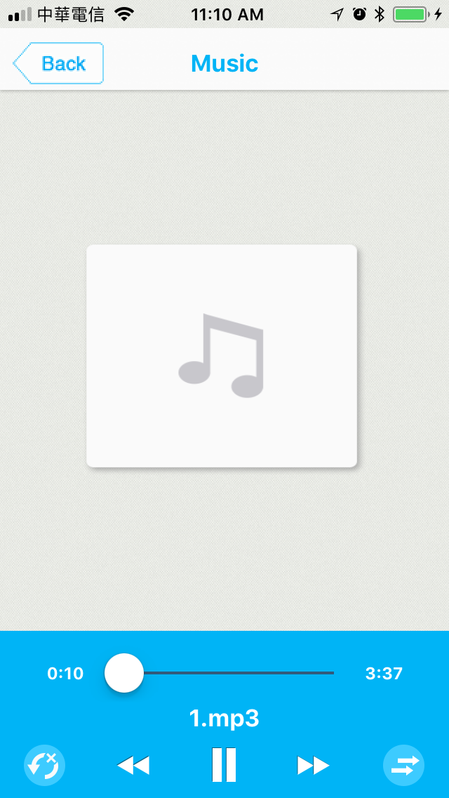

# IRMusicPlayer 

- IRMusicPlayer is a powerful music player for iOS.

## Features
- Support online/local play.
- Support to show music cover.
- Support randon mode.
- Support repeat modes: repeat all musics once, repeat current music forever, repeat all musics forever.

## Future
- Support background play.

## Install
### Git
- Git clone this project.
- Copy this project into your own project.
- Add the .xcodeproj into you  project and link it as embed framework.
#### Options
- You can remove the `demo` and `ScreenShots` folder.

### Cocoapods
- Add `pod 'IRMusicPlayer'`  in the `Podfile`
- `pod install`

## Usage

### Basic
```obj-c
@import IRMusicPlayer;

MusicPlayerViewController *vc = [[MusicPlayerViewController alloc] initWithNibName:@"MusicPlayerViewController" bundle:xibBundle];

[vc.musicListArray addObject:@{@"musicAddress": [[NSBundle mainBundle] pathForResource:@"1" ofType:@"mp3"]}];
[vc.musicListArray addObject:@{@"musicAddress": [[NSBundle mainBundle] pathForResource:@"2" ofType:@"mp3"]}];
[vc.musicListArray addObject:@{@"musicAddress": [[NSBundle mainBundle] pathForResource:@"3" ofType:@"mp3"]}];

[self presentViewController:vc animated:YES completion:nil];
```

### Advanced settings
- Use `MusicPlayerViewCallBackDelegate`.
```obj-c
@protocol MusicPlayerViewCallBackDelegate <NSObject>
-(void)didMusicChange:(NSString*)path;
@end
```

- Set `musicIndex` to controll which you want to play.
```obj-c
musicPlayerVC.musicIndex = 1;
[musicPlayerVC doPlay];
```

- Make your custome music cover image.
```obj-c
musicPlayerVC.coverView.image = <Csutom image>;
```

## Screenshots

